# 🚀 AKS Observability, Security & Monitoring Platform

A production-grade Kubernetes-based platform deployed on **Azure Kubernetes Service (AKS)** featuring full CI/CD automation, observability stack, security scanning, autoscaling, ingress management, and backup strategy using Velero.

---

# 📌 Project Overview

This project demonstrates a complete cloud-native DevOps platform built with:

- Kubernetes (AKS)
- Terraform Infrastructure as Code
- CI/CD Pipeline automation
- Prometheus + Grafana monitoring
- Loki log aggregation
- Trivy security scanning
- NGINX Ingress Controller with traffic metrics
- Velero backup system
- TLS/HTTPS security policies
- Autoscaling (HPA)
- Network policies & RBAC

The goal is to simulate a real production-level cloud environment used in modern DevOps/SRE teams.

---

# 🏗️ Architecture

### 1. Infrastructure Layer
- Azure Kubernetes Service (AKS)
- Terraform provisioning
- Azure Storage (Velero backups)

### 2. Application Layer
- Backend service (containerized)
- React frontend application
- Kubernetes deployments & services

### 3. Observability Layer
- Prometheus (metrics)
- Grafana (dashboards)
- Loki + Promtail (logs)

### 4. Security Layer
- Trivy image scanning
- TLS certificates (cert-manager)
- Network Policies
- RBAC

### 5. Traffic Layer
- NGINX Ingress Controller
- Rate limiting
- Request monitoring

---

# 📸 Screenshots & Observability

## 🧱 Infrastructure

### Terraform Apply

### Cluster Environment
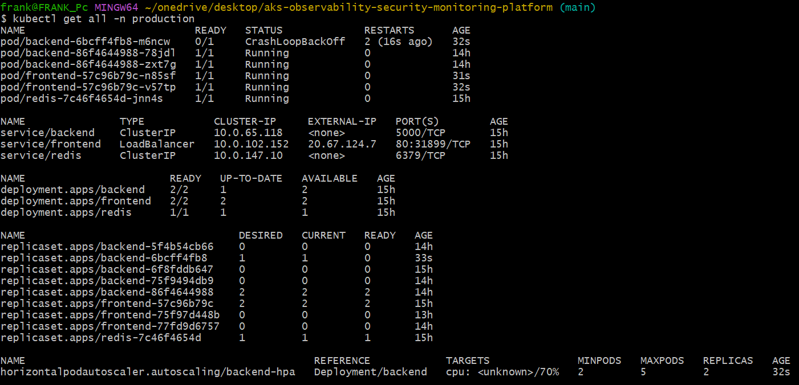

### Cluster State
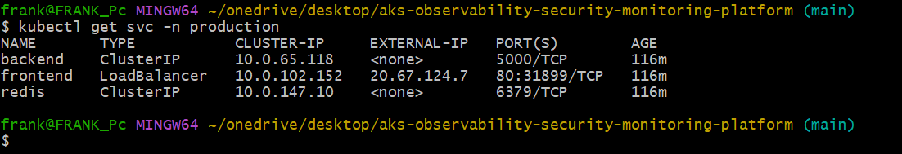

---

## 🖥️ Application Layer

### React App Created

### App Running in Browser
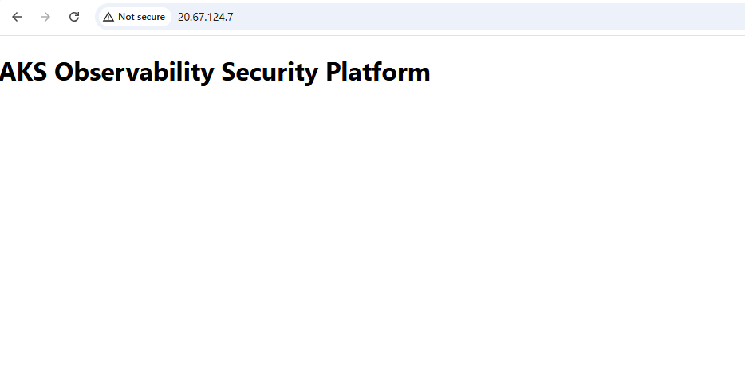

### Backend Observability
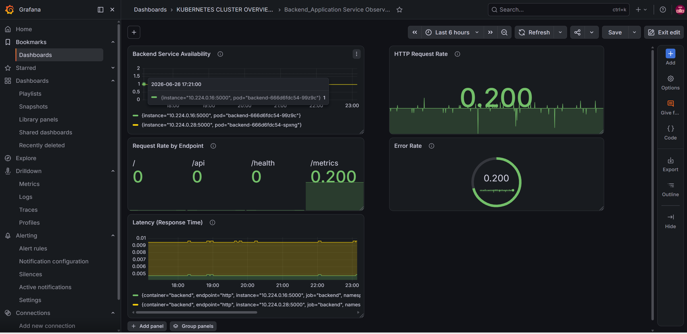

### Pods Running
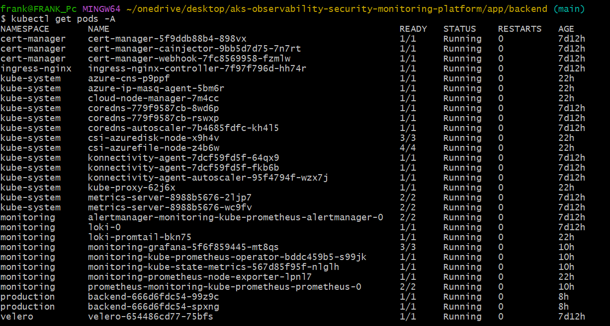

---

## 📊 Monitoring & Observability

### Kubernetes Cluster Overview
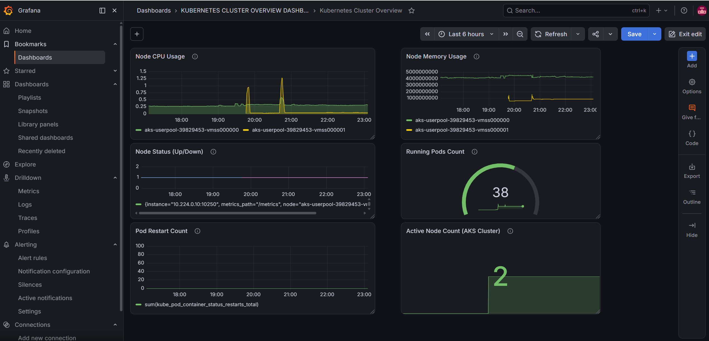

### Prometheus Targets
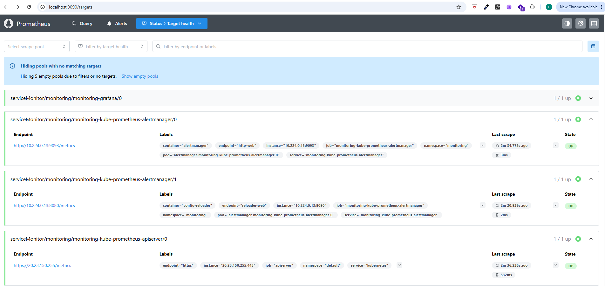

### Grafana Login
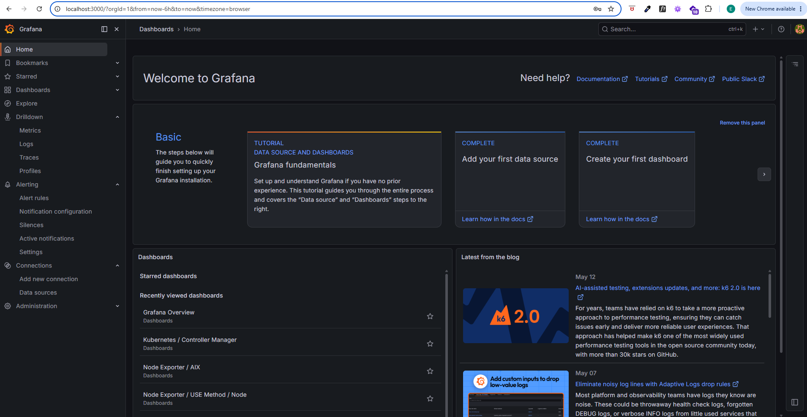

### Loki Log Explorer
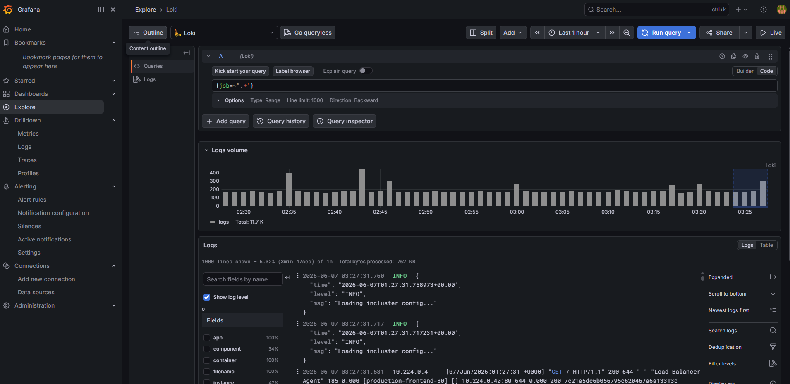

### Loki Health Status
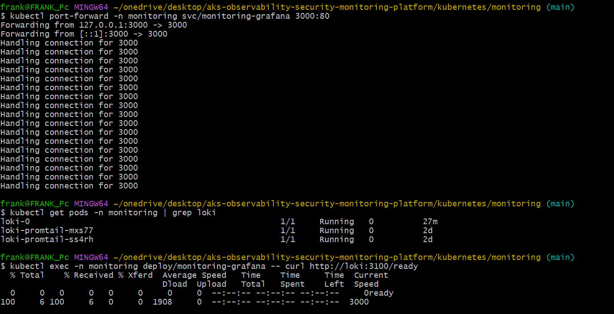

---

## 🌐 Ingress Monitoring

### Request Rate

### Traffic by Namespace

### Latency (P95)

### Top Services

### Error Rate

---

## 🔐 Security & CI/CD

### CI/CD Pipeline

### Trivy Scan
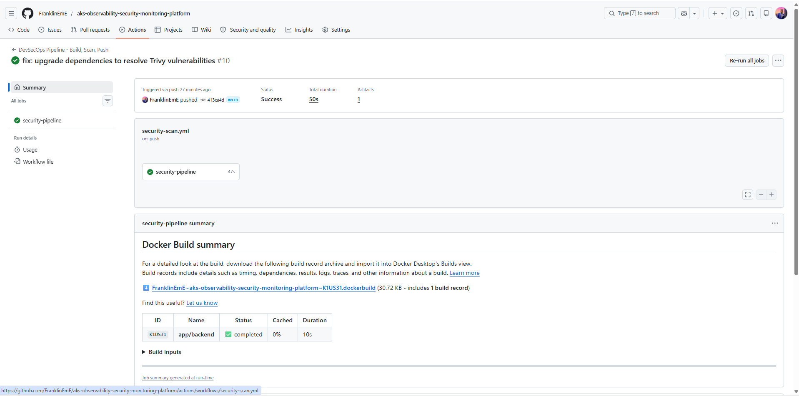

### Security Dashboard

---

## ⚙️ Automation

### Terraform Execution
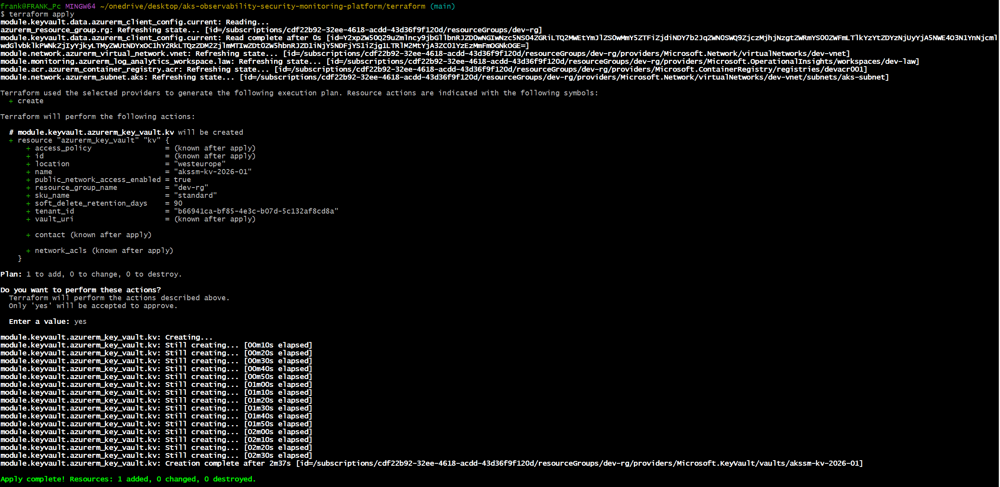

---

# 📦 Backup Strategy

- Velero configured for Kubernetes backups
- Azure Blob Storage as backup target
- Namespace-level restore capability

---

# 🔧 Tools & Technologies

- AKS (Azure Kubernetes Service)
- Kubernetes
- Terraform
- Docker
- Helm
- Prometheus
- Grafana
- Loki & Promtail
- NGINX Ingress Controller
- Trivy
- Velero
- GitHub Actions

---

# 🚀 Key Features

- Full cloud-native deployment on AKS
- Production-level observability stack
- Real-time metrics + logging
- CI/CD automation pipeline
- Security scanning (Trivy)
- TLS + ingress control
- Autoscaling (HPA)
- Disaster recovery (Velero)

---

# 📈 What This Project Demonstrates

- Kubernetes production readiness
- Azure cloud engineering skills
- DevOps CI/CD pipeline design
- Observability + monitoring expertise
- Security-first DevOps practices
- SRE-level infrastructure thinking

---

# 📌 Author

Franklin Chidera Emmanuel  
DevOps Engineer | Cloud & Kubernetes Enthusiast
